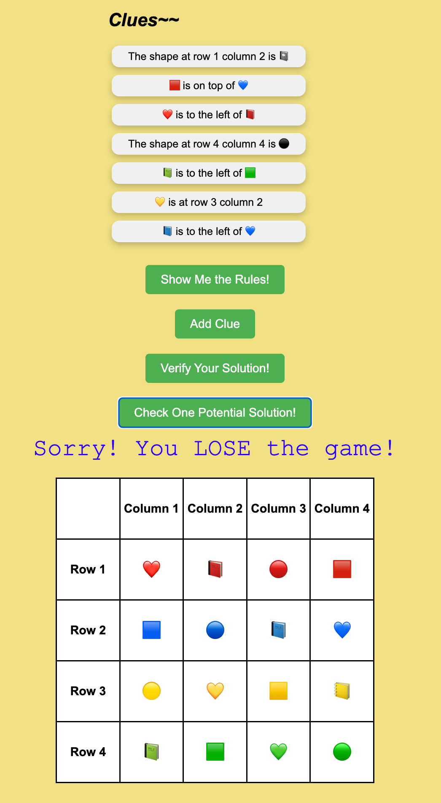

## CS151 Logic Programming Final Project
[Demo Link](https://lu-yumeng.github.io/CS151-logical-programming/)
### Rules
- There are 4 shapes: circle ⚫, square ⬛, heart 🖤, book 📓
- There are 4 colors: red 🟥, blue 🟦, green 🟩, yellow 🟨
- Goal: Fill the 4*4 grid with 16 emojis (4 shapes x 4 colors), and satisfy all the rules:
    - Rule 1: Each row consists of 4 emojis with the same color
    Rule 2: Each row and each column consists of 4 emojis with distinct shapes
    Rule 3: Clues Section are the constraints that your solution should satisfy
- Mode:
    - Easy Mode: You win as long as all clues are satisified
    - Hard Mode: You only win when your answer matches exactly as our answer
- You can use Add Clue button to add clues. Initially we will provide 7 clues and once you click Add Clue button, one more clue will be provided. You can get at most 12 clues in total.

### UI 
#### Homepage

#### Display Rule

#### Game UI

#### Display Result
